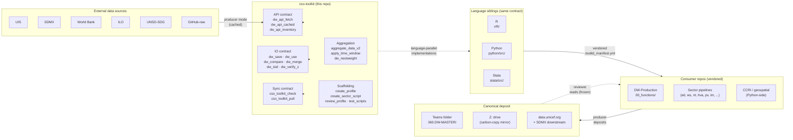
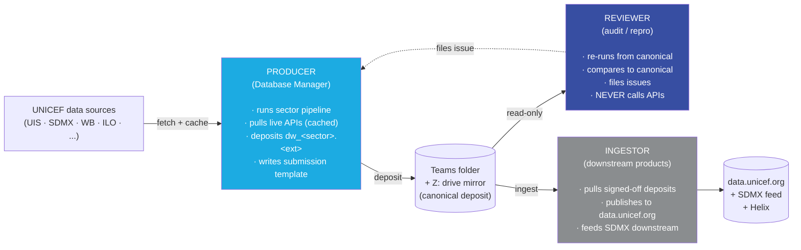

# cso-toolkit — UNICEF Chief Statistician Office toolkit

> Shared helpers, templates, and operating-model documentation for the
> **UNICEF Chief Statistician Office (CSO)**, within the **Office of
> Strategy and Evidence (OSE)**. One IO + API contract, one mode
> contract, three implementations (R · Python · Stata), one vendoring
> model.

[](https://github.com/unicef-drp/cso-toolkit/actions/workflows/r-check.yml)
[](LICENSE)
[](https://github.com/unicef-drp/cso-toolkit/releases)

---

## TL;DR

- One way to **read, write, compare, and merge** data — auto-dispatched
  by file extension; writes emit a `.provenance.json` sidecar by
  default (`sha256`, schema, user, timestamp, metadata; opt out with
  `provenance = FALSE`; `.RData` / `.rda` writes skip the sidecar).
- One way to **hit external APIs** — UIS, SDMX, World Bank, ILO,
  UNSD-SDG, GitHub-raw — with a deposit cache and a reviewer-mode
  lockout that physically prevents network calls.
- **Producer / reviewer** is a session-level mode, not a per-call
  argument; the contract is enforced at every wrapped call site, not
  by convention.
- Same behaviour across **R**, **Python**, and **Stata**; vendored
  into consumer repos via a 1-line manifest pin, not installed over
  the network.

## Table of contents

- [Motivation](#motivation)
- [Architecture at a glance](#architecture-at-a-glance)
- [Three roles, one contract](#three-roles-one-contract)
- [What's inside — by capability](#whats-inside--by-capability)
- [Quick start](#quick-start)
- [Install / vendor](#install--vendor)
- [Versioning and roadmap](#versioning-and-roadmap)
- [Testing and CI](#testing-and-ci)
- [License and citation](#license-and-citation)

---

## Motivation

`cso-toolkit` exists to **facilitate the reproducibility and scalability
of analytics developed by the UNICEF Chief Statistician Office (CSO),
within the Office of Strategy and Evidence (OSE)**. Concretely, it does
three things:

1. **Encodes a single IO + API contract.** One way to read, write,
   compare, and merge data; one way to hit external APIs. Every call
   routes through wrappers that enforce provenance sidecars, uniqueness
   checks, and the producer / reviewer mode contract — so any analytics
   product can be rerun by someone other than its original author and
   yield the same numbers.

2. **Separates producer and reviewer mode at the session level.** The
   Database Manager (producer) pulls live APIs and deposits canonical
   artefacts; the reviewer reruns from those frozen artefacts and is
   physically prevented from touching the network. The contract is
   enforced by the toolkit at every wrapped call site, not by
   convention.

3. **Scales across sectors and projects.** The same helpers, the same
   templates, and the same audit functions are vendored into every
   sector codebase under the CSO, which means new sectors and new
   projects inherit the reproducibility floor for free instead of
   re-inventing it.

Why this matters in practice: a 2026 publication that cites
`dw_<sector>.csv` must, two years later, produce identical numbers
when re-run by a reviewer who has only the canonical deposit and the
vendored helpers — no network access, no upstream package drift, no
ambient `dplyr` version skew.

---

## Architecture at a glance



Three layered ideas:

- **The toolkit** (this repo) encodes the contract once. It groups its
  helpers into five capability families: **IO**, **external API**,
  **vintage sync**, **aggregation**, and **scaffolding / audit**.
- **Three language siblings** (R, Python, Stata) implement the same
  contract in idiomatic form for each language. Same function names,
  same `.provenance.json` schema, same mode-aware path routing, same
  error-envelope shape (`[cso_toolkit.<func>] WHAT / Why / Fix`).
- **Consumer repos** (DW-Production, sector pipelines, CCRI / geospatial)
  vendor the helpers into their own `00_functions/`. The producer
  deposits artefacts into the canonical Teams / Z: store; reviewers
  re-run against the frozen deposit without ever calling out.

---

## Three roles, one contract

The toolkit's mode contract distinguishes **three roles** that touch
the data warehouse, each with a strict capability boundary the toolkit
enforces at every wrapped call site:



| Role | What they do | Where they write | Network access |
|---|---|---|---|
| **PRODUCER** (DBM) | Runs the sector pipeline, pulls upstream APIs, deposits final `dw_<sector>.<ext>` into the warehouse, writes a submission template. | The canonical deposit (`060.DW-MASTER`). | **Yes** — `dw_apis_allowed = TRUE`. |
| **REVIEWER** | Re-runs the sector pipeline from pre-deposited inputs, compares against the canonical deposit, files issues. | A sandbox (`sandboxRoot`). Never touches canonical. | **No** — `dw_apis_allowed = FALSE`. Every API call site raises with a mode-lock message. |
| **INGESTOR** | Pulls signed-off deposits into `data.unicef.org`, SDMX, and downstream products. | Internal infrastructure outside this repo. | N/A. |

The mode is a **session property** read once at profile load time
(`dw_mode` in `~/.config/user_config.yml`). It is not a per-call
argument. See [`docs/mode_contract_integration.md`](docs/mode_contract_integration.md)
for the wiring.

---

## What's inside — by capability

Each capability family is implemented in all three language siblings
unless flagged. Per-function reference docs are linked in the right
column.

### IO contract — `dw_save`, `dw_use`, `dw_compare`, `dw_merge`, `dw_isid`, `dw_verify_z`

Uniform file IO with auto-dispatch by extension
(CSV / TSV / XLSX / RDS-or-PKL / DTA / Parquet / JSON / YAML), `isid`
uniqueness check, automatic `.provenance.json` sidecar, Z: drive mirror
on canonical writes, integrity check on canonical reads.

| Function | R | Python | Stata | Reference |
|---|---|---|---|---|
| `dw_save` | ✅ | ✅ | ✅ | [R](docs/dw_io_reference.md) · [Python](docs/dw_io_python_reference.md) |
| `dw_use` | ✅ | ✅ | ⏳ (#5) | same as above |
| `dw_compare` | ✅ | ✅ | ✅ | same |
| `dw_merge` | ✅ | ✅ | — | R + Python only |
| `dw_isid` | ✅ | ✅ | (embedded in `dw_save`) | same |
| `dw_verify_z` | ✅ | ✅ | — | R + Python only |

`dw_use` accepts **HTTPS URLs** since v0.4.0 — producer downloads
once and freezes the response under `_frozen/<host>/<path>` with a
`.provenance.json` sidecar; reviewer reads only from the frozen
copy. Allowlist is configured per-consumer (empty by default).

### Cached external APIs — `dw_api_fetch`, `dw_api_cached`, `dw_api_inventory`

Mode-aware wrapper around 10 external data sources. Producer hits the
live API and caches under `_apis/<api>/<cache_key>.<ext>`; reviewer
reads only from the cache. Secrets in caller kwargs are redacted
before they reach the provenance sidecar.

| `api =` value | Source | R | Python |
|---|---|---|---|
| `"uis"` | UNESCO UIS REST | ✅ | ✅ |
| `"sdmx"` | Generic SDMX | ✅ | ✅ |
| `"sdmx_codelist"` | UNICEF SDMX codelist | ✅ | ✅ |
| `"wb"`, `"wb_indicators"` | World Bank WDI | ✅ | ✅ |
| `"ilo"` | ILO SDMX | ✅ | ✅ |
| `"unsd_sdg"` | UNSD SDG API | ✅ | ✅ |
| `"github_raw"` | Pinned-commit raw.githubusercontent.com | ✅ | ✅ |
| `"http"`, `"json_get"` | Generic HTTP / JSON | ✅ | ✅ |

References: [R](docs/dw_api_reference.md) · [Python](docs/dw_api_python_reference.md).

### Aggregation and survey weights — `aggregate_data_v2`, `apply_time_window`, `generate_agg_footnote`, `dw_nestweight`

`aggregate_data_v2()` covers `weighted_mean` / `mean` / `sum` /
`proportion` with population + country coverage and a coverage
threshold. `apply_time_window()` filters to the latest observation
per country within an inclusive year window. `dw_nestweight()` is an
R port of World Bank EduAnalyticsToolkit's
[`edukit_nestweight`](https://github.com/worldbank/EduAnalyticsToolkit)
(Diana Goldemberg) — redistributes survey weights from missing nested
observations so per-stratum totals are preserved (R + Python).

### Project scaffolding — `create_profile`, `create_sector_script`, `review_profile`

`create_profile()` scaffolds a `profile_<repo>.R` (or `.py`) with the
standard CSO building blocks: cross-platform user identification, YAML
config load, producer / reviewer `dw_mode` resolution, optional Z:
drive advisory, packages block, sentinel object. `review_profile()`
audits an existing profile for the same building blocks and reports
`pass` / `warn` / `fail` per check. `create_sector_script()` (and the
DW-Production convenience wrapper `create_dw_sector_script()`)
scaffolds a sector run-script template with profile verification,
logging, runtime tracking, and try/catch.

### Contract auditing — `test_scripts`

Recursively scans a directory of `.R` (or `.py`) scripts and flags any
direct call to a raw file-IO or external-API command that the toolkit
wraps (e.g. `read_csv`, `pd.read_csv`, `httr::GET`, `requests.get`,
`rsdmx::readSDMX`, `sdmx.Client`). Per-line escape hatch via
`# cso-allow: <rule-id>`; CI-mode via `error_on_violation = TRUE`
fails the build on any violation.

### Vintage sync — `cso_toolkit_check`, `cso_toolkit_diff`, `cso_toolkit_pull`

Consumer-side helpers that read the local `.toolkit_manifest.yml`,
query upstream for the latest tag, and warn / refresh when the
consumer is behind. Reviewer mode forbids the network call.

### Graceful error envelopes — across every helper

Every `stop()` / `raise` follows a three-part shape so library errors
are grep-friendly and actionable:

```text
[cso_toolkit.dw_save] Reviewer mode forbids writes under canonical: /path
  Reviewer sessions must keep canonical deposits read-only to preserve
  vintage permanence; writes go to the sandbox.
  Fix:
    1. Resolve a sandbox path instead, OR
    2. If this is a deliberate DBM bootstrap, pass `allow_canonical_write = TRUE`.
```

The leading `[cso_toolkit.<func>]` prefix lets you grep a consumer
project for sites that hit a given error class.

---

## Quick start

Same code shape across the three siblings — pick yours.

### R

```r
# 1. Source the vendored helpers (normally done by profile_<repo>.R)
source("00_functions/dw_io.R")
source("00_functions/dw_api.R")

# 2. Set session-level mode + paths
dw_mode <- "producer"
dw_apis_allowed <- TRUE
teamsWrkData <- "/path/to/wrk"

# 3. Use the contract
library(dplyr)
df <- tibble::tibble(REF_AREA = c("AGO", "BFA"), OBS_VALUE = c(0.5, 0.7))
dw_save(df, name = "dw_ed_edu.csv", sector = "ed", kind = "wrk",
        isid = "REF_AREA",
        metadata = list(title = "Education indicators", vintage = "2026-05"))
```

### Python

```python
from cso_toolkit import _state, dw_save, dw_use
import pandas as pd

_state.configure(
    teamsWrkData="/path/to/wrk",
    dw_mode="producer",
    dw_apis_allowed=True,
)

df = pd.DataFrame({"REF_AREA": ["AGO", "BFA"], "OBS_VALUE": [0.5, 0.7]})
dw_save(df, name="dw_ed_edu.csv", sector="ed", kind="wrk",
        isid=["REF_AREA"],
        metadata={"title": "Education indicators", "vintage": "2026-05"})
```

### Stata

```stata
* Wire the mode contract in your profile
global dw_mode "producer"
global teamsWrkDataCanonical "C:/.../013_wrkdata"

* Use the contract
use "input.dta", clear
dw_save using "dw_ed_edu.dta",      ///
    idvars(REF_AREA INDICATOR)      ///
    title("Education indicators")   ///
    vintage("2026-05")
```

Per-language full-flavour quick starts live at
[`r/README.md`](r/README.md),
[`python/README.md`](python/README.md),
[`stata/README.md`](stata/README.md).

---

## Install / vendor

Production model is **vendoring** — consumers (DW-Production sector
codebases) copy the helpers into their own `00_functions/` and pin a
version in `.toolkit_manifest.yml`. Why not `source()` /
`pip install` / `net install` over the network:

- **Vintage permanence.** A 2026-05 release re-run must use the helper
  code as it stood in 2026-05. Network sourcing breaks that.
- **AppLocker reality.** UNICEF laptops block many script-installable
  paths; copy-into-`00_functions/` always works.
- **Offline reproducibility.** Reviewers on planes / customs / corporate
  networks need the helpers locally.

For local development, each language also supports a native install
path (`devtools::install_local("r/")`, `pip install -e python/`,
`adopath ++ "stata/src"`). Vendoring stays the production model.

See [`docs/toolkit_strategy.md`](docs/toolkit_strategy.md) for the full
rationale + upgrade flow, and
[`templates/.toolkit_manifest.yml`](templates/.toolkit_manifest.yml)
for the manifest schema.

---

## Versioning and roadmap

Semantic versioning (MAJOR.MINOR.PATCH).

| Tag | Released | Highlights |
|---|---|---|
| `v0.1.0-rc1` | 2026-05-24 | R helpers feature-complete; Stata / Python scaffolded. |
| `v0.2.0` | 2026-05-24 | Stata helpers shipped (`dw_save`, `dw_compare`, `dw_mkdir`); `dw_nestweight` ported from EduAnalyticsToolkit; workflow diagrams. |
| `v0.3.0` | 2026-05-25 | Full Python port (10 modules, 26 public entries); Roxygen-complete R reference (26 Rd files + pkgdown); graceful three-part error envelopes across R + Python; secrets-redaction in `.provenance.json`. |
| `v0.4.0` | 2026-05-26 | DW-Production backports (B1 remote-URL freeze, B2 gzip auto-detect, B3 sidecar `tryCatch`, B4 URLencode + cache-ext fix); testthat regression suite (237 PASS); GitHub Actions CI; tightened producer / reviewer mode contract for `dw_save` + `dw_use` — redundant Teams + Z: producer writes, network-first reviewer reads, `overwrite` default flipped TRUE → FALSE (issue #14, **BREAKING**); remaining Stata helpers — `dw_use`, `dw_require_no_api`, `dw_load_config` (issue #5); R demographics family — `dw_pop()` + `dw_regions()` (issues #17 + #18); `dw_publish()` STUB (issue #15; dry-run only, live submission deferred to v0.5.0). |
| `v0.5.0` | _planned_ | Live `dw_publish()` submission branch (Helix endpoint + auth + idempotency); Python + Stata siblings of `dw_pop()` and `dw_regions()`. |
| `v1.0.0` | _committed API_ | After the `ed` sector pilot lands and a second sector vendors the helpers without modification. |

**Changelog.** Per-release notes — including breaking-change migration
notes and per-PR provenance — live in [`NEWS.md`](NEWS.md) (the
toolkit follows the R-ecosystem `NEWS.md` convention; there is no
separate `CHANGELOG.md`).

---

## Testing and CI

The toolkit ships a layered test surface. Every layer runs both
locally and on CI (`.github/workflows/r-check.yml`).

| Layer | What it catches |
|---|---|
| **R `testthat` suite** (`r/tests/testthat/`, 125+ assertions) | Unit + regression coverage for every helper. `expect_envelope()` asserts the `[cso_toolkit.<func>] WHAT / Why / Fix` shape on every raise. |
| **R `R CMD check`** | Rd syntax, NAMESPACE drift, undefined globals, `\examples{}` blocks. Target: 0 errors / 0 warnings / 0 notes. |
| **Python smoke test** (`python/tests/manual/smoke_test.py`, 20 invariants) | Round-trip behaviour, provenance sidecar, mode contract, B1–B4 regressions. **Manual-only** — run via `python python/tests/manual/smoke_test.py`. |
| **Python error-envelope test** (`python/tests/manual/error_envelope_test.py`, 30 paths) | Every public raise carries the standard envelope. **Manual-only.** |
| **R manual smoke** (`r/tests/manual/check_consumer_side.R`) | End-to-end vendoring scenario against `api.github.com`. **Manual-only.** |
| **GitHub Actions** (`.github/workflows/r-check.yml`) | Runs `R CMD check` (which invokes the R `testthat` suite) across `ubuntu-latest` (R release + devel), `macos-latest` (release), and `windows-latest` (release) on every push / PR. The Python and R-manual layers above are **not yet wired into CI** — tracked as a follow-up. |

---

## License and citation

Code under [MIT](LICENSE); documentation under CC BY 4.0.

> UNICEF Chief Statistician Office, *cso-toolkit: Shared helpers and
> operating model for child-indicator data warehousing*, v0.3.0 (2026),
> <https://github.com/unicef-drp/cso-toolkit>

---

## See also

- [`r/README.md`](r/README.md) — R package overview (install, layout,
  quick start, error envelope, testing).
- [`python/README.md`](python/README.md) — Python package overview.
- [`stata/README.md`](stata/README.md) — Stata package overview.
- [`docs/roles_and_workflow.md`](docs/roles_and_workflow.md) — full
  PRODUCER / REVIEWER / INGESTOR role definitions + per-role workflow.
- [`docs/toolkit_strategy.md`](docs/toolkit_strategy.md) — why the
  vendoring model exists.
- [`docs/mode_contract_integration.md`](docs/mode_contract_integration.md)
  — how to wire `dw_mode` into a sector profile.
- [`docs/dw_io_reference.md`](docs/dw_io_reference.md) +
  [`docs/dw_io_python_reference.md`](docs/dw_io_python_reference.md)
  — per-function IO references.
- [`docs/dw_api_reference.md`](docs/dw_api_reference.md) +
  [`docs/dw_api_python_reference.md`](docs/dw_api_python_reference.md)
  — per-function API references.
- [`templates/dbm_submission_template.md`](templates/dbm_submission_template.md)
  — eight-section pre-deposit checklist.
