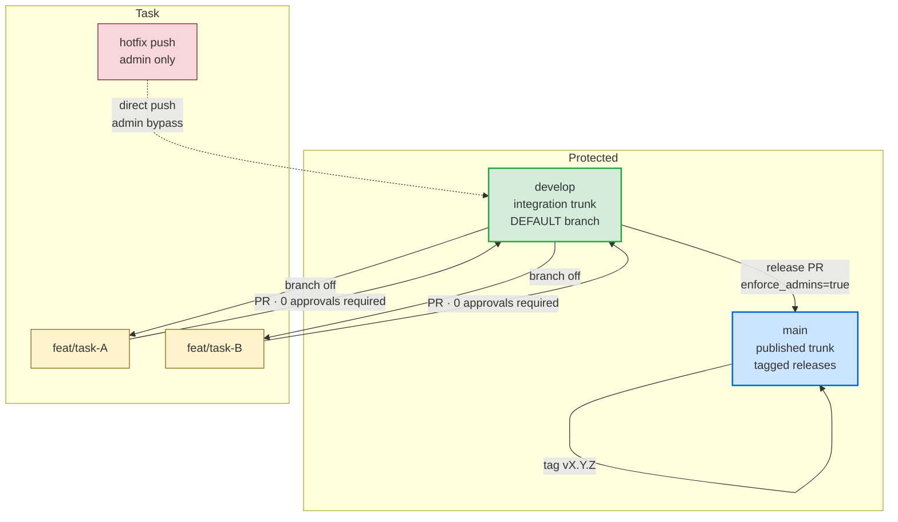

# Git workflow

The `unicef-drp/cso-toolkit` repo follows a **two-trunk gitflow**: `main` is
the published trunk, `develop` is the integration trunk, and all task work
happens on short-lived `feature/*` (or `feat/*`) branches off `develop`.
Hotfix pushes directly to `develop` are permitted for admins only.

## Branches at a glance

| Branch | Role | Default | PR required | Force push | Deletion | Admin bypass |
|---|---|---|---|---|---|---|
| `main` | Published trunk — tagged releases live here | no | yes | blocked | blocked | **no** (`enforce_admins=true`) |
| `develop` | Integration trunk — what new work targets | **yes** | yes (0 approvals) | blocked | blocked | **yes** (hotfix path) |
| `feature/*` · `feat/*` | Short-lived task branches off `develop` | no | n/a | allowed (own branch) | allowed | n/a |
| `hotfix/*` (optional) | Same shape as `feat/*` but signalling intent | no | n/a | allowed (own branch) | allowed | n/a |

## Flow



## The contract these rules enforce

1. **Nothing reaches `main` except via a release PR from `develop`.**
   `enforce_admins=true` on `main` means even repo admins must open the PR;
   the protection has no admin escape hatch. This keeps the public-facing
   trunk auditable and tag-able.
2. **All task work targets `develop`.** Open a `feat/<topic>` (or
   `feature/<topic>`) branch off `develop`, push commits, open a PR back to
   `develop`. Required-approvals count is `0` so a solo author can self-merge
   — but the PR itself is mandatory, which gives CI and reviewers a stable
   target to look at.
3. **Hotfix exception on `develop` only.** `enforce_admins=false` on
   `develop` means repo admins can push directly when a fix is urgent enough
   that the PR ceremony would do more harm than good. Use sparingly; record
   the rationale in the commit message so the audit trail survives.
4. **Force pushes and branch deletion are blocked on both trunks.** The
   `allow_force_pushes=false` and `allow_deletions=false` settings prevent
   rewriting published history or accidentally dropping a trunk.

## Standard recipes

### Task work (the 95% case)

```bash
git checkout develop
git pull
git checkout -b feat/short-topic

# ... work, commit atomically ...

git push -u origin feat/short-topic
gh pr create --base develop --head feat/short-topic \
    --title "feat(area): short description" \
    --body-file pr-body.md
gh pr merge --merge   # preserves "Y"-shape lineage; do not squash by default
```

### Release `develop` → `main`

```bash
git checkout develop
git pull
gh pr create --base main --head develop \
    --title "release: vX.Y.Z" \
    --body-file release-notes.md
# ... merge via UI or:
gh pr merge --merge

git checkout main && git pull
git tag -a vX.Y.Z -m "Release vX.Y.Z"
git push origin vX.Y.Z
```

### Hotfix (admin path)

For genuinely urgent fixes that cannot wait for a PR cycle:

```bash
git checkout develop
git pull
# ... make the minimal fix, commit with a clear "hotfix:" prefix ...
git push origin develop
```

The admin bypass on `develop` lets this push through. The same commit must
then be carried into the next release PR to `main` so the public trunk
catches up — the hotfix does **not** automatically reach `main`.

### Recovering from a wrong-branch commit

There are two distinct cases. Pick the one that matches.

**Case 1 — the bad commit is still local (you have not pushed yet).**
You can rewind your local `develop` to match the remote because no one else
has seen the commit. Save the work on a new branch first:

```bash
git branch feat/recover-work      # save the work on a new branch
git reset --hard origin/develop   # rewind LOCAL develop to the remote tip
git checkout feat/recover-work    # continue work on the new branch
```

**Case 2 — the bad commit has already been pushed to `origin/develop`.**
You cannot rewrite history on the remote: the branch protection blocks
force pushes (and even admin bypass on `develop` does not unlock
`allow_force_pushes`). The commit is therefore *permanent* in the sha
chain; the only correct remediation is to make a **new** commit that
undoes it (`git revert`) or fixes it forward, then push normally:

```bash
git checkout develop
git pull
git revert <sha-of-bad-commit>   # creates a new commit that undoes <sha>
git push origin develop
```

If the bad commit also contained work you want to keep on a feature
branch, cherry-pick it onto a new branch *before* reverting:

```bash
git branch feat/recover-work <sha-of-bad-commit>
git revert <sha-of-bad-commit>
git push origin develop
git checkout feat/recover-work    # continue work on the new branch
```

The `git reset --hard` recipe from Case 1 is local-only — running it on
Case 2 just desyncs your working tree from the remote and the next
`git pull` will bring the bad commit back.

## See also

- [`roles_and_workflow.md`](roles_and_workflow.md) — the parallel role
  contract on the data side (PRODUCER / REVIEWER / PUBLISHER).
- [`toolkit_strategy.md`](toolkit_strategy.md) — vendoring model and version
  cadence; explains why `main` tags matter for downstream consumers.
