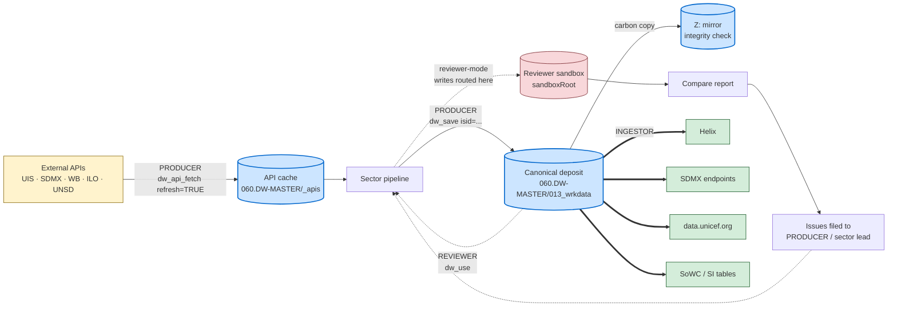
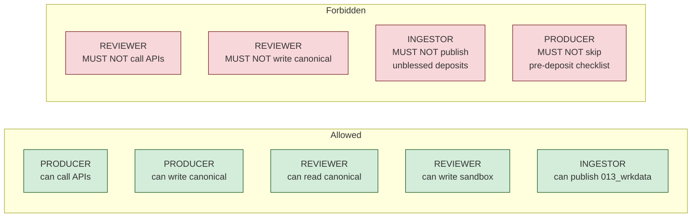

# Roles and Workflow

> Canonical source: `00_documentation/roles_and_workflow.md`.
> Book chapter at `book/chapters/<NNN>-roles-and-workflow.qmd` includes
> this file via Quarto's `` shortcode — don't edit two
> places.

## Three roles in the DW-Production lifecycle

The pipeline has three distinct roles. They share the helpers in `00_functions/` (`dw_io.R`, `dw_api.R`), they share the same path globals from `profile_DW-Production.R`, but **they read and write different parts of the filesystem and they have different obligations.**

### Data flow at a glance

The diagram below shows who reads, who writes, who pulls from external APIs, and where the mode contract draws hard lines. Solid arrows are normal flow; dashed arrows are read-only paths.



Read the diagram by colour:

- **Yellow** — external upstream APIs. Only the **PRODUCER** session can touch them; reviewer-mode sessions are physically prevented by `dw_require_no_api()`.
- **Blue** — canonical artefacts. **PRODUCER** writes; **REVIEWER** reads (with Z: integrity check); **INGESTOR** publishes from `013_wrkdata`.
- **Pink** — the per-user sandbox. Reviewer-mode `dw_save` calls route here; canonical writes hard-fail.
- **Green** — downstream consumers. Reached only via the INGESTOR role.

### Role-vs-action matrix



| Role | Reads from | Writes to | API calls | Owns |
|---|---|---|---|---|
| **PRODUCER** (Database Manager) | upstream APIs + `060.DW-MASTER` | `060.DW-MASTER` (Teams + Z: mirror) | YES | refreshing cached upstream data; producing the deposited indicator outputs |
| **REVIEWER** (auditor / sector-lead validation) | `060.DW-MASTER` (read-only) + sandbox | sandbox only (`sandboxRoot` per user) | NO — forbidden by `dw_require_no_api()` | reproducibility validation; sector-lead sign-off; finding bugs |
| **INGESTOR** (warehouse publisher) | `060.DW-MASTER/013_wrkdata` (PRODUCER-blessed outputs) | data warehouse: Helix, SDMX endpoints, data.unicef.org, SoWC tables | reads warehouse-publication endpoints only | publication into the canonical UNICEF data warehouse and downstream surfaces |

The session-level `dw_mode` setting in `~/.config/user_config.yml` controls the PRODUCER / REVIEWER split at the technical level. INGESTOR is a third workflow not yet wired into the mode contract (future scope; see end).

## Folder layout — what each role touches

```
060.DW-MASTER/                                   ← PRODUCER writes; REVIEWER + INGESTOR read
├── 01_dw_prep/
│   ├── 010_metadata/                            ← repo-tracked; PRODUCER updates via PR
│   ├── 011_rawdata/
│   │   ├── <sector>/input/                      ← PRODUCER: raw upstream files (manual deposits / SDMX bulk dumps)
│   │   ├── <sector>/output/
│   │   │   ├── final/<sector>_tocopy.<ext>      ← PRODUCER: staging file from pipeline run
│   │   │   ├── branches/<slug>/final/...        ← PRODUCER: branch-isolated runs (auto via nt-pattern conductor)
│   │   │   └── temp/<sector>_compare_*          ← compare reports (REVIEWER + PRODUCER read; PRODUCER writes from pipeline run)
│   │   ├── hosted_in_repo/<sector>/             ← runtime-derived precondition inputs (see ed/README.md)
│   │   └── _apis/<api>/<cache_key>.<ext>        ← PRODUCER: API caches; REVIEWER reads
│   └── 013_wrkdata/dw_<sector>.csv              ← PRODUCER: promoted from _tocopy; INGESTOR's input

sandboxRoot/                                     ← REVIEWER writes; per-user; sandboxed
└── 01_dw_prep/
    ├── 011_rawdata/<sector>/output/             ← REVIEWER's pipeline produces here
    └── 013_wrkdata/                             ← REVIEWER's compare reports land here

Z:/ drive (UNICEF Azure file share)              ← PRODUCER carbon-copies canonical writes;
                                                   REVIEWER's dw_use verifies Teams == Z:

data warehouse / Helix / SDMX endpoints          ← INGESTOR writes from 060.DW-MASTER/013_wrkdata
data.unicef.org / SoWC SI tables                 ← INGESTOR publishes from the same source
```

## Common helpers used by each role

The `00_functions/` helpers (`dw_io.R`, `dw_api.R`) are shared. Each role uses a different subset.

| Helper | PRODUCER | REVIEWER | INGESTOR |
|---|---|---|---|
| `dw_save(x, ..., allow_canonical_write)` | writes to 060 (Z: mirror automatic) | sandbox writes only; canonical writes hard-fail | reads only |
| `dw_use(...)` | reads anywhere | reads from sandbox + canonical fallback; Z: integrity check | reads `013_wrkdata` |
| `dw_api_fetch(api, ..., refresh)` | fetches live + caches in 060 | reads cache or stops via `dw_require_no_api` | n/a |
| `dw_api_cached(api, cache_key)` | reads cache | reads cache | n/a |
| `dw_api_inventory(api = NULL)` | audits cache freshness | audits what's available | audits provenance pre-publication |
| `dw_compare(current, reference, ...)` | runs on every production run | runs on every reviewer run | reads compare reports as a publication gate |
| `dw_verify_z(path)` | runs after canonical write to verify mirror landed | runs on canonical reads to verify integrity | runs as a final pre-publication check |
| `dw_isid(df, keys)` | enforces row uniqueness pre-write | spot-checks reproduced data | optional spot-check |
| `dw_merge(x, using, by, how)` | used in sector pipelines | used in reproduction | n/a |

## Workflow per role

### PRODUCER

The Database Manager. Owns the deposit.

1. **Set mode**: `dw_mode: "producer"` in `~/.config/user_config.yml`.
2. **Refresh upstream caches** (per source cadence):
   - UNESCO UIS: per UIS publication calendar
   - World Bank: typically annual (May/June)
   - UNICEF SDMX: per UNPD-Production refresh
   - ILO: per ILOSTAT publication
   - UNSD SDG: per SDG cadence
   - GitHub regional metadata: per pin in `_apis/github_raw/`
   - Use `dw_api_fetch(refresh = TRUE)` for each cache; verify `.provenance.json` records the new vintage.
3. **Run sector conductors** in producer mode (`make run-<sector>` or `source(<sector>/0_execute_conductor.R)`). Each conductor:
   - Reads inputs from `060/011_rawdata/<sector>/input/`
   - Reads cached upstream from `060/.../_apis/`
   - Writes staging to `060/011_rawdata/<sector>/output/final/<sector>_tocopy.<ext>`
   - On non-stable branch: writes to `branches/<slug>/`
4. **Run compare-vs-prior-vintage**: `dw_compare(current = tocopy, reference = teamsWrkData/dw_<sector>.csv, ...)`.
5. **Complete the pre-deposit checklist**: `tools/dbm_submission_template.md`.
6. **Promote**: copy `<sector>_tocopy.csv` to `013_wrkdata/dw_<sector>.csv`. (Future: a `make promote-<sector>` target; currently manual.)
7. **Mirror to Z:**: automatic via `dw_io.R` (if mounted); manual rsync as fallback.
8. **Tag / changelog**: `CHANGELOG.md` updated, optional GitHub release tag.

### REVIEWER

Anyone reproducing or validating. The audit / QA role.

1. **Set mode**: `dw_mode: "reviewer"` + `sandboxRoot` in `~/.config/user_config.yml`.
2. **Source the profile**: `source("profile_DW-Production.R")`. Red banner fires if Z: is unmounted (non-blocking).
3. **Run sector conductors**: same scripts as PRODUCER, but the profile redirects writes to the sandbox. Reads come from 060 (canonical) via dw_io's fallback.
4. **Run `make compare`** (or the conductor's step 6): produces per-segment CSV reports under `tempdir/<sector>_compare_warehouse/`.
5. **Interpret the report**: each value-column drift > tolerance is a finding. Classify:
   - data drift (the deposit changed since last reviewer run)
   - methodology drift (the code changed but deposit hasn't been refreshed)
   - reproduction bug (the code path differs from the producer's run)
   - cache miss (a required upstream cache isn't in 060)
6. **File issues** against the relevant sector lead or DBM with the structured finding.
7. **MUST NOT** write to canonical paths. The mode contract enforces this via `dw_save`'s call-site check; bypassing requires `allow_canonical_write = TRUE` (intended for DBM bootstraps only).
8. **MUST NOT** call external APIs. The mode contract enforces this via `dw_api_fetch`'s reviewer-mode branch + `dw_require_no_api()` helper.

### INGESTOR

The warehouse publisher. Takes blessed outputs from 060 and pushes them into the canonical UNICEF data infrastructure.

This role is not yet codified in `00_functions/`. Documenting the boundary today; helpers are future-scope.

1. **Read from `060.DW-MASTER/01_dw_prep/013_wrkdata/dw_<sector>.csv`** — only after PRODUCER has promoted.
2. **Pre-publication gates**:
   - Compare report from PRODUCER's run shows no unaccounted-for drift
   - All P0 issues from the upstream cluster (UNPD-Population, etc.) are either resolved or explicitly accepted with sector-lead sign-off
   - `dw_verify_z(path)` shows Teams == Z: byte-equal
   - The deposit's `.provenance.json` chain links back to original API fetches
3. **Publication targets** (each has its own validation + transport):
   - **Helix**: UNICEF's internal data system; receives `.dta` and `.csv` per sector convention; current Stata pipelines write here directly via `$savedir_helix`.
   - **SDMX endpoints**: structured publication into `sdmx.data.unicef.org/...` for downstream consumers (UN agencies, journalists, researchers). Currently a separate workflow run by SDMX team.
   - **data.unicef.org**: country profiles + regional dashboards consume from 013_wrkdata via curated extracts (the `04_create_webpage_data_*.R` Excel outputs map here).
   - **State of the World's Children / State of African Children**: editorial tables built from the same 013_wrkdata via the SI table macros.
4. **Rollback procedure** when a published value is later found wrong:
   - PRODUCER amends the source data → re-promotes
   - INGESTOR re-publishes with a corrigendum note
   - SDMX endpoint version-bumps the dataflow
5. **Future helpers** (not in scope yet): `dw_publish(file, target = "helix" | "sdmx" | "data_portal" | "sowc")`, parallel to `dw_save` / `dw_api_fetch`.

## Boundaries — what each role MUST NOT do

| Role | Forbidden |
|---|---|
| **PRODUCER** | skip the pre-deposit checklist; deposit without a compare-vs-prior-vintage report; deposit without sector-lead sign-off on non-trivial deltas |
| **REVIEWER** | write to canonical paths; call external APIs; modify caches in 060 |
| **INGESTOR** | promote outputs that haven't passed PRODUCER's checklist + REVIEWER's compare; publish without provenance chain back to original API fetches; rollback without amending the source |

## See also

- `00_functions/README.md` — helper docs (dw_io.R, dw_api.R)
- `tools/dbm_submission_template.md` — PRODUCER's pre-deposit checklist
- `book/appendices/d-sector-coverage.qmd` — per-sector reproducibility status (which sectors are at which adoption level)
- `profile_DW-Production.R` — mode contract enforcement
- `unicef-drp/DW-Production#85` — example of a REVIEWER-filed issue against the PRODUCER role
- `unicef-drp/DW-Production#88` — adoption-tracker for cross-sector dw_io / dw_api migration
